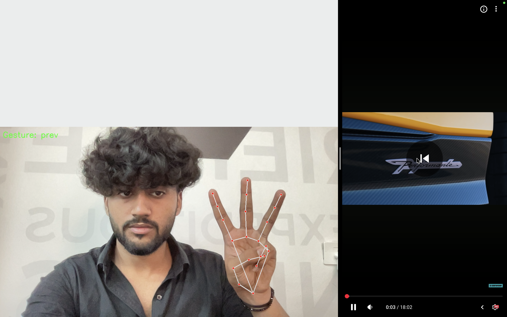
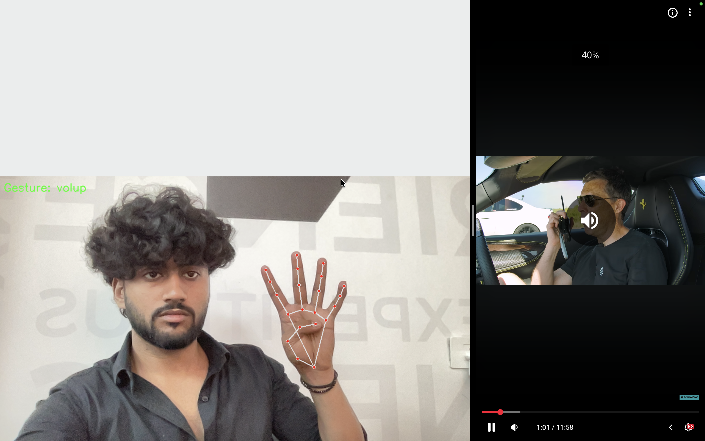
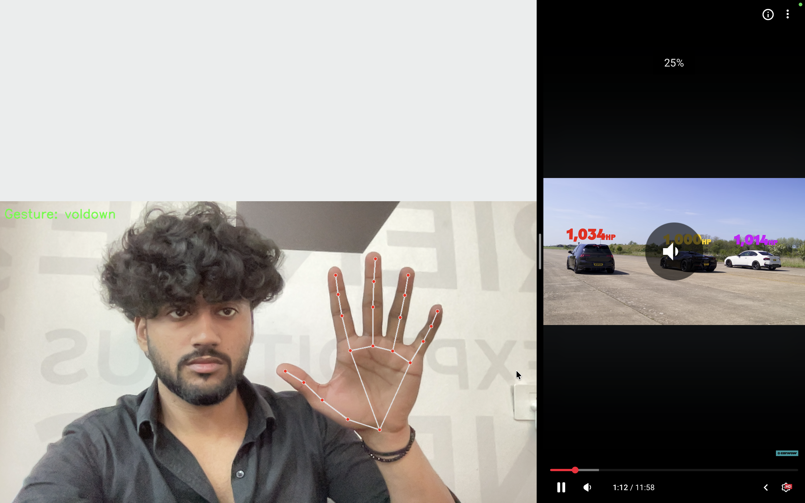

# 🎵 Gesture-Based Music Control System

Control your system music using hand gestures in real-time through your webcam.

---

## 🚀 Project Demo

### ▶ Play (1 Finger)


---

### ⏭ Next (2 Fingers)


---

### ⏮ Previous (3 Fingers)



---

### 🔊 Volume Up (4 Fingers)



---

### 🔉 Volume Down (5 Fingers)



---

### 🔇 Mute (Fist)


---

## 🖐 Supported Gestures

| Gesture | Action |
|----------|--------|
| ☝️ 1 Finger | Play |
| ✌️ 2 Fingers | Next |
| 🤟 3 Fingers | Previous |
| 🖐 4 Fingers | Volume Up |
| ✋ 5 Fingers | Volume Down |
| ✊ Fist | Mute |

---

## 🛠 Tech Stack

- Python
- OpenCV
- MediaPipe
- NumPy
- PyAutoGUI
- Scikit-learn

## 📂 Project Structure

```
Gesture-Based-Music-Control-System/
│
├── project/
│   ├── app.py                  # Main application
│   ├── collect_gestures.py     # Collect gesture training data
│   ├── train_model.py          # Train machine learning model
│   ├── gesture_model.pkl       # Trained model file
│   ├── gestures.csv            # Dataset of collected gestures
│   └── requirements.txt        # Project dependencies
│
├── assets/                     # Gesture images
│   ├── play-pause.png
│   ├── next.png
│   ├── prev.png
│   ├── volup.png
│   ├── voldown.png
│   └── mute.png
│
├── README.md                   # Project documentation
└── LICENSE                     # License file
```

