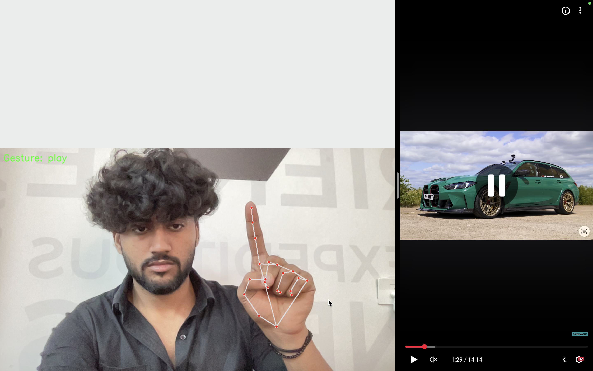
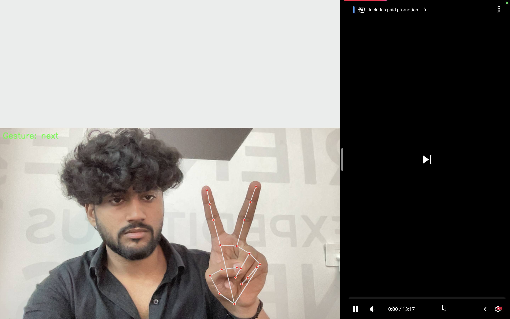
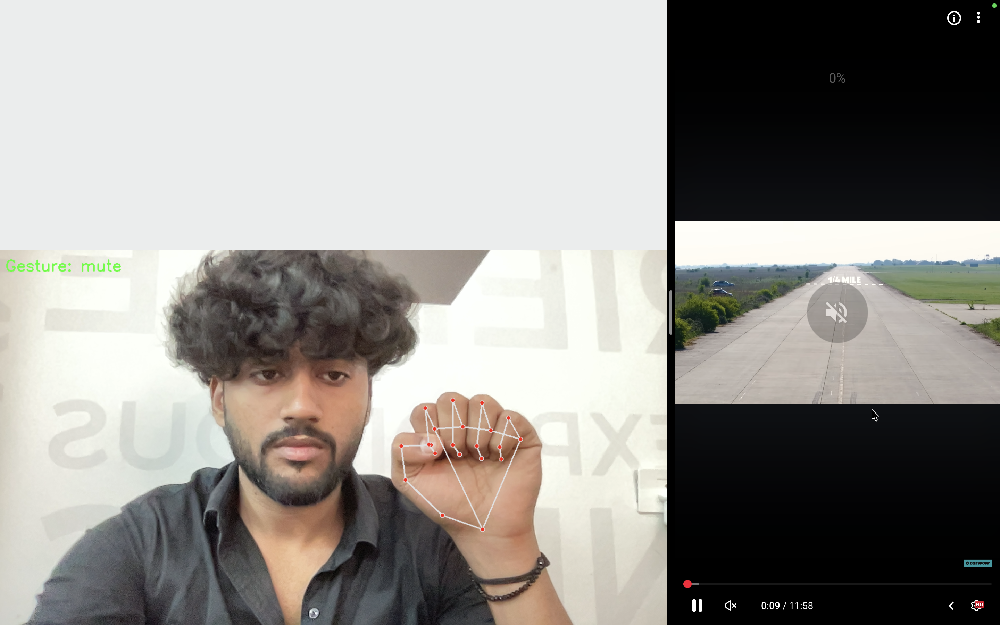

# Gesture-Based-Music-Control-System

# 🎵 Gesture-Based Music Control System

Control your system music using hand gestures in real-time through your webcam.

---

## 🚀 Project Demo

### ▶ Play (1 Finger)

---

### ⏭ Next (2 Fingers)

---

### ⏮ Previous (3 Fingers)

---

### 🔊 Volume Up (4 Fingers)

---

### 🔉 Volume Down (5 Fingers)

---

### 🔇 Mute (Fist)

---

## 🖐 Supported Gestures

| Gesture | Action |
|----------|--------|
| ☝️ 1 Finger | Play |
| ✌️ 2 Fingers | Next |
| 🤟 3 Fingers | Previous |
| 🖐 4 Fingers | Volume Up |
| ✋ 5 Fingers | Volume Down |
| ✊ Fist | Mute |

---

## 🛠 Tech Stack

- Python
- OpenCV
- MediaPipe
- NumPy
- PyAutoGUI
- Scikit-learn

## 📂 Project Structure

